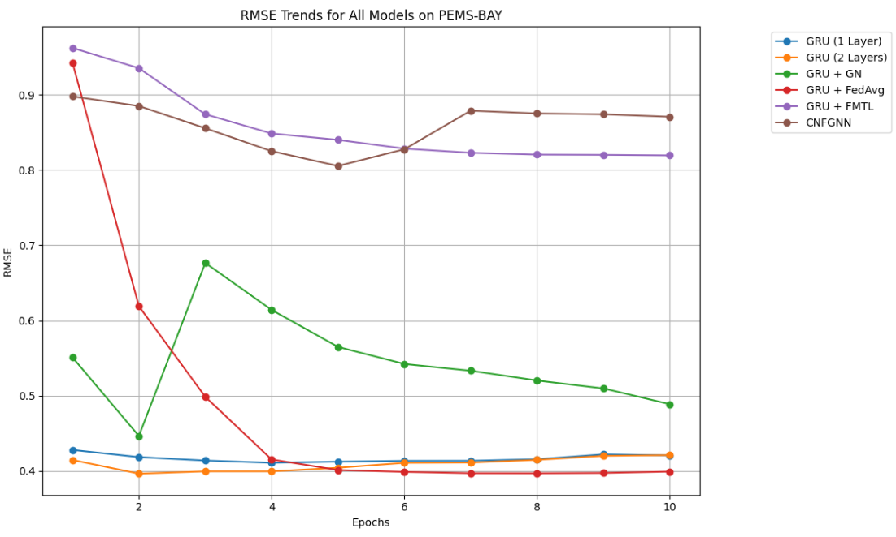
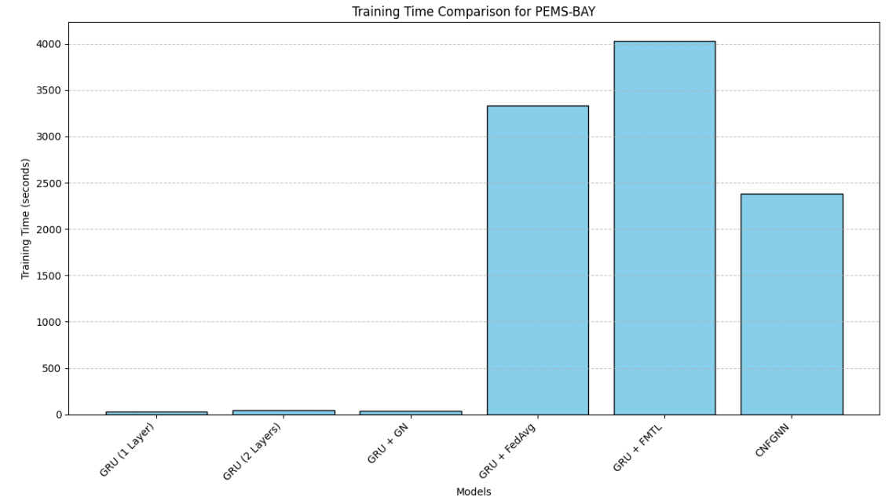
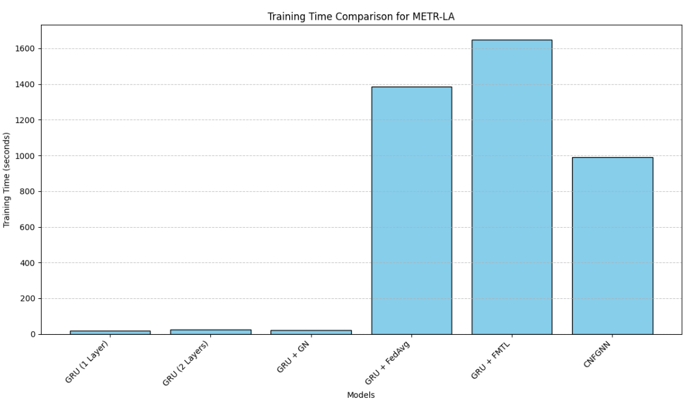
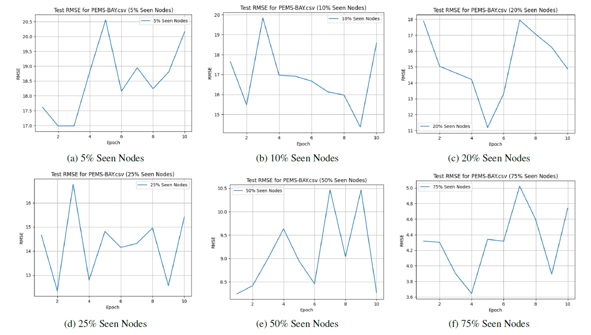
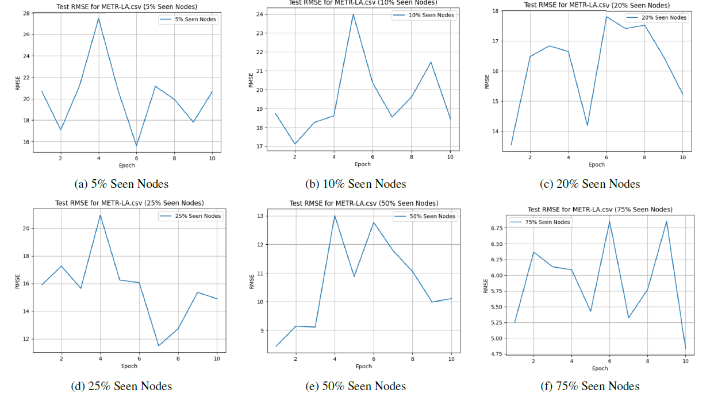

# Celebrity Image Reconstruction using Deep Convolutional Variational AutoEncoder with Perceptual Loss (CVAE-PL)

In this study, multiple GRU-based models and the CNFGNN architecture are investigated for their effectiveness in spatiotemporal traffic prediction tasks using the PEMS-BAY and METR-LA datasets. The models were evaluated based on three key metrics: RMSE for predictive accuracy, training time for computational efficiency and competence of CNFGNN in inductive settings. The Jupyter Notebook, named [final.ipynb](final.ipynb), contains the complete documentation and Python implementation for training, evaluation, and comparison of the models. The [inductive.ipynb](inductive.ipynb) file the necessary setup for evaluating performance of CNFGNN in inductive settings.
# RMSE for CNFGNN and other base methods over 10 epochs on PEMS-BAY dataset

# RMSE for CNFGNN and other base methods over 10 epochs on METR-LA dataset

# Model training time comparison for PEMS-BAY dataset

# Model training time comparison for METR-LA dataset

# CNFGNN’s RMSE on PEMS-BAY dataset in inductive settings

# CNFGNN’s RMSE on METR-LA dataset in inductive settings

### Dataset
For the investigations, the publicly accessible PEMS-BAY and METR-LA datasets are used.  For easy access, the datasets have been incorporated into the codebase. The PEMS-BAY and METR-LA datasets are described in further detail [here](https://zenodo.org/records/5146275).

### How to Use
1. Make a local copy of the repository.
2. Launch and operate the Jupyter Notebook or Google Colab notebook [final.ipynb](final.ipynb) in your preferred environment to train the models and evaluate their RMSE and training time comparison.
3. Launch and operate the Jupyter Notebook or Google Colab notebook [inductive.ipynb](inductive.ipynb) in your preferred environment to see how well the CNFGNN model is performing over different percentage of seen nodes.
### Give Google Colab a try!
By clicking the link at the top of the notebook, you may quickly examine and run the source code in a Google Colab environment. You can also check [here](http://colab.research.google.com/github/AbhiJeet70/PerceptualLossVAE/blob/main/Perceptual_Loss_in_VAE.ipynb)

## ⭐ Give a Star!

If you found this project useful or interesting, please consider giving it a star on GitHub! Your support is greatly appreciated and helps to motivate me to keep improving the project. Here’s how you can give a star:

1. **Sign in to GitHub**: Make sure you are logged into your GitHub account. If you don't have an account, please sign up.

2. **Navigate to the Repository**: Go to the repository page.

3. **Click the Star Button**: At the top right of the repository page, click the "Star" button. That’s it!

 
